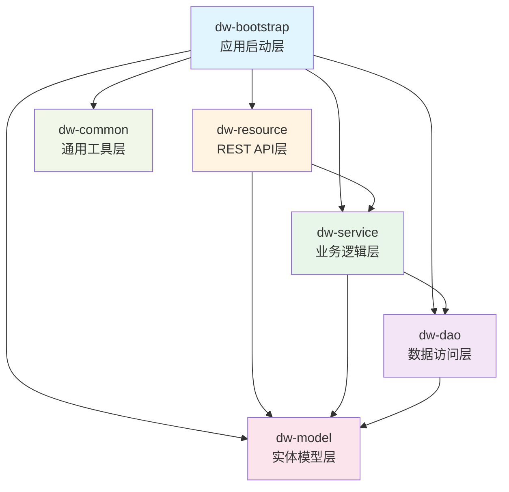
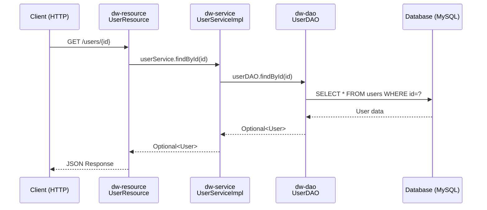

# Dropwizard Test Project

一个基于 Dropwizard 框架的多模块 Java Web 应用程序，采用分层架构设计，使用 HK2 进行依赖注入。

## 📋 目录

- [技术栈](#技术栈)
- [项目结构](#项目结构)
- [模块说明](#模块说明)
- [架构图](#架构图)
- [依赖关系](#依赖关系)
- [快速开始](#快速开始)
- [API 端点](#api-端点)

## 🛠 技术栈

- **框架**: Dropwizard 4.0.0
- **语言**: Java 21
- **ORM**: Hibernate (via Dropwizard Hibernate)
- **依赖注入**: HK2 (GlassFish HK2)
- **数据库**: MySQL 8.0
- **构建工具**: Maven
- **其他工具**: 
  - Lombok (代码简化)
  - Reflections (类扫描)
  - JUnit 5 (测试)

## 📦 项目结构

```
dw-test-02/
├── dw-model/          # 实体模型层
├── dw-common/         # 通用工具层
├── dw-dao/            # 数据访问层
├── dw-service/        # 业务服务层
├── dw-resource/       # REST 资源层（API 层）
├── dw-bootstrap/      # 应用启动层
├── pom.xml            # 父 POM
├── run.bat            # Windows 启动脚本
└── run.sh             # Linux/Mac 启动脚本
```

## 🏗 模块说明

### 1. dw-model (实体模型层)
- **包名**: `com.gutou.model.entity`
- **职责**: 定义领域实体类（Entity）
- **依赖**: 
  - Jakarta Persistence API (JPA)
  - Lombok
- **示例**: `User.java`

### 2. dw-common (通用工具层)
- **包名**: `com.gutou.common`
- **职责**: 存放通用的工具类和公共代码
- **状态**: 预留模块，目前为空
- **用途**: 未来可存放工具类、常量、异常类等

### 3. dw-dao (数据访问层)
- **包名**: `com.gutou.dao`
- **职责**: 数据库访问操作（Data Access Object）
- **依赖**: 
  - dw-model
  - Dropwizard Hibernate
- **特点**: 继承 `AbstractDAO`，由 HK2 自动绑定
- **示例**: `UserDAO.java`

### 4. dw-service (业务服务层)
- **包名**: `com.gutou.service`
- **职责**: 业务逻辑处理
- **依赖**: 
  - dw-dao
  - dw-model
  - HK2 API (用于依赖注入)
- **特点**: 
  - 使用 `@Contract` 定义接口
  - 使用 `@Service` 标注实现类
  - 由 HK2 自动扫描和绑定
- **示例**: 
  - `UserServiceApi.java` (接口)
  - `UserServiceImpl.java` (实现)

### 5. dw-resource (REST 资源层)
- **包名**: `com.gutou.resource`
- **职责**: 定义 RESTful API 端点
- **依赖**: 
  - dw-service (业务逻辑)
  - dw-model (实体类作为输入输出)
  - Dropwizard Core
  - HK2 API
- **特点**: 
  - 使用 Jersey `@Path` 注解
  - 使用 `@UnitOfWork` 管理事务
  - 通过依赖注入使用 Service 层
- **示例**: 
  - `UserResource.java`
  - `ContainerInspectorResource.java`

### 6. dw-bootstrap (应用启动层)
- **包名**: `com.gutou.app`
- **职责**: 应用启动、配置管理和框架初始化
- **依赖**: 所有其他模块
- **内容**:
  - `DwTestApplication.java` - 应用主类
  - `DwTestConfiguration.java` - 配置类
  - 核心工具类：
    - `Hk2DaoBinder` - DAO 自动绑定
    - `Hk2ServiceBinder` - Service 自动绑定
    - `JerseyResourceRegistrar` - Resource 自动注册
  - 配置文件: `config.yml`
- **特点**: 使用 Maven Shade Plugin 打包成可执行 JAR

## 🎨 架构图

### 模块依赖关系图

#### Mermaid 流程图 (支持 GitHub/GitLab 渲染)



#### ASCII 文本图

```
┌─────────────────────────────────────────────────────────┐
│                   dw-bootstrap                          │
│              (应用启动 & 配置管理)                        │
│  - DwTestApplication                                    │
│  - Hk2DaoBinder, Hk2ServiceBinder                      │
│  - JerseyResourceRegistrar                             │
└───────────────┬─────────────────────────────────────────┘
                │ 依赖所有模块
                │
        ┌───────┴────────┐
        │                │
┌───────▼────────┐ ┌─────▼─────────────────┐
│  dw-resource   │ │   dw-service          │
│  (REST API层)   │ │   (业务逻辑层)         │
│                │ │                       │
│  UserResource  │ │  UserServiceApi       │
│                │ │  TaskMngApi           │
└───────┬────────┘ └─────┬─────────────────┘
        │                │
        │ 依赖 service    │ 依赖 dao
        │ 和 model        │ 和 model
        │                │
┌───────▼────────┐ ┌─────▼─────────────────┐
│   dw-service   │ │      dw-dao           │
│   (已包含)      │ │   (数据访问层)         │
│                │ │                       │
│                │ │  UserDAO              │
└────────────────┘ └─────┬─────────────────┘
                         │ 依赖 model
                         │
                ┌────────▼─────────┐
                │    dw-model      │
                │   (实体模型层)    │
                │                  │
                │  User (Entity)   │
                └──────────────────┘
```

### 分层架构图

#### Mermaid 序列图 (调用流程)



#### ASCII 文本图

```
┌─────────────────────────────────────────────────────────┐
│                    Client (HTTP)                        │
└───────────────────────┬─────────────────────────────────┘
                        │
                        ▼
┌─────────────────────────────────────────────────────────┐
│              dw-resource (REST API 层)                  │
│  ┌────────────────────────────────────────────────┐    │
│  │  @Path("/users")                               │    │
│  │  UserResource                                  │    │
│  │  - 处理 HTTP 请求                              │    │
│  │  - 参数验证                                    │    │
│  │  - 调用 Service                                │    │
│  └────────────────────────────────────────────────┘    │
└───────────────────────┬─────────────────────────────────┘
                        │ 调用
                        ▼
┌─────────────────────────────────────────────────────────┐
│              dw-service (业务服务层)                     │
│  ┌────────────────────────────────────────────────┐    │
│  │  @Service                                      │    │
│  │  UserServiceImpl                               │    │
│  │  - 业务逻辑处理                                │    │
│  │  - 事务管理                                    │    │
│  │  - 调用 DAO                                    │    │
│  └────────────────────────────────────────────────┘    │
└───────────────────────┬─────────────────────────────────┘
                        │ 调用
                        ▼
┌─────────────────────────────────────────────────────────┐
│              dw-dao (数据访问层)                         │
│  ┌────────────────────────────────────────────────┐    │
│  │  AbstractDAO<User>                            │    │
│  │  UserDAO                                      │    │
│  │  - 数据库 CRUD 操作                           │    │
│  │  - SQL/HQL 查询                               │    │
│  └────────────────────────────────────────────────┘    │
└───────────────────────┬─────────────────────────────────┘
                        │ 操作
                        ▼
┌─────────────────────────────────────────────────────────┐
│              Database (MySQL)                           │
└─────────────────────────────────────────────────────────┘
```

### 依赖注入流程

```
应用启动 (dw-bootstrap)
    │
    ├─→ Hk2DaoBinder
    │   └─→ 扫描 com.gutou.dao 包
    │       └─→ 自动绑定所有 AbstractDAO 子类
    │
    ├─→ Hk2ServiceBinder
    │   └─→ 扫描 com.gutou.service 包
    │       └─→ 自动绑定所有 @Service 类到 @Contract 接口
    │
    └─→ JerseyResourceRegistrar
        └─→ 扫描 com.gutou.resource 包
            └─→ 自动注册所有 @Path 标注的类
```

## 🔗 依赖关系

### 模块依赖链

```
dw-bootstrap
  ├─→ dw-resource
  │     ├─→ dw-service
  │     │     ├─→ dw-dao
  │     │     │     └─→ dw-model
  │     │     └─→ dw-model
  │     └─→ dw-model
  ├─→ dw-service
  ├─→ dw-dao
  ├─→ dw-model
  └─→ dw-common

依赖规则:
- Resource 层 → Service 层 + Model 层
- Service 层 → DAO 层 + Model 层
- DAO 层 → Model 层
- Bootstrap 层 → 所有模块
```

### 禁止的依赖方向

- ❌ Resource 层不能直接依赖 DAO 层
- ❌ Service 层不能依赖 Resource 层
- ❌ DAO 层不能依赖 Service 或 Resource 层
- ❌ Model 层不依赖任何其他模块

## 🚀 快速开始

### 前置要求

- JDK 21+
- Maven 3.6+
- MySQL 8.0+
- 数据库 `dw_test` 已创建

### 1. 配置数据库

编辑 `dw-bootstrap/src/main/resources/config.yml`：

```yaml
database:
  driverClass: com.mysql.cj.jdbc.Driver
  url: jdbc:mysql://localhost:3306/dw_test?useSSL=false&serverTimezone=Asia/Shanghai
  user: root
  password: your_password
```

### 2. 编译项目

```bash
mvn clean package
```

### 3. 运行应用

**Windows:**
```bash
.\run.bat
```

**Linux/Mac:**
```bash
./run.sh
```

或者直接运行 JAR:
```bash
java -jar dw-bootstrap/target/dw-bootstrap-1.0-SNAPSHOT.jar server dw-bootstrap/src/main/resources/config.yml
```

### 4. 验证运行

访问: http://localhost:8080

## 📡 API 端点

### 用户管理

| 方法 | 路径 | 说明 |
|------|------|------|
| GET | `/users` | 获取所有用户 |
| GET | `/users/{id}` | 根据 ID 获取用户 |
| GET | `/users/email/{email}` | 根据邮箱获取用户 |
| POST | `/users` | 创建用户 |
| PUT | `/users/{id}` | 更新用户 |
| DELETE | `/users/{id}` | 删除用户 |
| GET | `/users/task` | 任务测试接口 |

### 容器信息

| 方法 | 路径 | 说明 |
|------|------|------|
| GET | `/container` | 查看所有注册的服务 |
| GET | `/container/summary` | 容器统计信息 |
| GET | `/container/type/{typeName}` | 按类型查询服务 |

### 管理端点

| 方法 | 路径 | 说明 |
|------|------|------|
| GET | `/admin` | 管理界面 |
| GET | `/admin/tasks` | 任务列表 |

## 🔧 开发说明

### 添加新的业务功能

1. **添加实体类** (dw-model)
   ```java
   // dw-model/src/main/java/com/gutou/model/entity/YourEntity.java
   @Entity
   public class YourEntity { ... }
   ```

2. **添加 DAO** (dw-dao)
   ```java
   // dw-dao/src/main/java/com/gutou/dao/YourDAO.java
   public class YourDAO extends AbstractDAO<YourEntity> { ... }
   ```

3. **添加 Service** (dw-service)
   ```java
   // 接口
   @Contract
   public interface YourServiceApi { ... }
   
   // 实现
   @Service
   public class YourServiceImpl implements YourServiceApi { ... }
   ```

4. **添加 Resource** (dw-resource)
   ```java
   // dw-resource/src/main/java/com/gutou/resource/YourResource.java
   @Path("/your-path")
   public class YourResource {
       @Inject
       private YourServiceApi yourService;
       ...
   }
   ```

### 自动扫描机制

- **DAO**: 自动扫描继承 `AbstractDAO` 的类
- **Service**: 自动扫描带 `@Service` 注解的类
- **Resource**: 自动扫描带 `@Path` 注解的类

所有扫描都在应用启动时自动完成，无需手动注册。

## 📝 配置文件说明

主要配置文件位于: `dw-bootstrap/src/main/resources/config.yml`

包含配置项：
- 服务器配置（端口、路径等）
- 数据库配置
- 日志配置
- Hibernate 配置

## 🧪 测试

运行测试:
```bash
mvn test
```

## 📄 许可证

本项目用于学习和测试目的。

## 👥 贡献

欢迎提交 Issue 和 Pull Request！

---

## 🔄 多实现注入与执行顺序（@Rank）

在 HK2 中，一个 `@Contract` 接口可能会有多个 `@Service` 实现（例如启动任务、策略实现、插件扩展点等）。此时常见需求是：

1. **注入并获取该 Contract 的所有实现**
2. **按照固定顺序依次执行**

### 1) 定义 Contract 与多个实现

```java
import org.jvnet.hk2.annotations.Contract;

@Contract
public interface JobService {
    void execute();
}
```

```java
import lombok.extern.slf4j.Slf4j;
import org.glassfish.hk2.api.Rank;
import org.jvnet.hk2.annotations.Service;

@Slf4j
@Service
@Rank(10) // 数值越小优先级越高（项目约定）
public class StartUpJob2 implements JobService {
    @Override
    public void execute() {
        log.info("StartUpJob2 execute");
    }
}
```

```java
import lombok.extern.slf4j.Slf4j;
import org.glassfish.hk2.api.Rank;
import org.jvnet.hk2.annotations.Service;

@Slf4j
@Service
@Rank(20) // 数值越小优先级越高（项目约定）
public class StartUpJob1 implements JobService {
    @Override
    public void execute() {
        log.info("StartUpJob1 execute");
    }
}
```

> **约定说明**：本项目采用“`@Rank` 数值越小优先级越高”的规则（与 HK2 默认的“数值越大越优先”相反），因此在自动绑定阶段会做一次 rank 映射（见下文）。

---

### 2) 自动绑定时将 @Rank 写入 HK2 Descriptor（并反转优先级）

由于本项目使用 `Hk2ServiceBinder` 通过反射扫描并手工 `bind()`，需要在绑定时显式设置 `.ranked(...)`，否则 `@Rank` 只存在于类注解中，**不会影响 HK2 的候选选择与迭代顺序**。

为实现“rank 越小越优先”，绑定时需将注解值映射为 HK2 的 rank（HK2 默认：rank 越大越优先）：

```java
private int getRank(Class<?> serviceClass) {
    Rank r = serviceClass.getAnnotation(Rank.class);

    // 未标注 Rank 的实现默认排最后（项目约定）
    int original = (r == null) ? 1_000_000_000 : r.value();

    // 映射到 HK2：original 越小 => hk2Rank 越大（越优先）
    return Integer.MAX_VALUE - original;
}
```

---

### 3) 注入全部实现并按顺序执行

推荐使用 `IterableProvider<T>` 注入全部实现：

```java
import jakarta.inject.Inject;
import jakarta.inject.Singleton;
import org.glassfish.hk2.api.IterableProvider;

@Singleton
public class StartUpJobManager {

    private final IterableProvider<JobService> jobs;

    @Inject
    public StartUpJobManager(IterableProvider<JobService> jobs) {
        this.jobs = jobs;
    }

    public void start() {
        // 注意：在 ranked(...) 生效后，IterableProvider 的迭代顺序就是按 rank 排好的
        for (JobService job : jobs) {
            job.execute();
        }
    }
}
```

执行顺序将为：

* `@Rank(10)` 的实现先执行
* `@Rank(20)` 的实现后执行

---

### 4) 仅注入单个实现的选择规则

当使用：

```java
@Inject
private JobService jobService;
```

且存在多个实现时，HK2 会选择“优先级最高”的实现作为默认注入目标。
在本项目中，由于在 Binder 阶段做了 rank 反转映射，因此默认会注入 **`@Rank` 数值最小** 的那个实现。

---

### 5) 最佳实践建议

* 对“扩展点/插件点/任务链”类接口，建议统一使用 `@Rank` 控制执行顺序。
* 未标注 `@Rank` 的实现建议默认排在最后，避免意外抢占执行顺序。
* 若存在强依赖顺序的任务（例如必须先初始化 A 才能执行 B），请用 `@Rank` 明确表达，不要依赖扫描顺序或类名顺序。


**最后更新**: 2025-01-03

